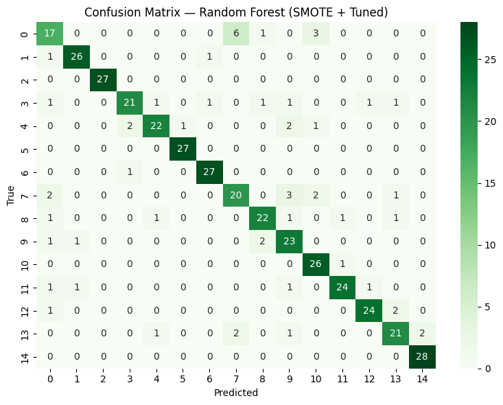

# Random Forest Confusion Matrix Analysis

**Model:** Calibrated Random Forest (SMOTE + Hyperparameter Tuned)  
**Location:** `reports/figures/confusion_matrix_Random_Forest_Smote_Tuned.png`  
**Overall Accuracy:** 86.2% (412 test samples)  
**Macro F1-Score:** 0.861

---

## Key Performance Insights

### ✅ Best Performers (High Precision & Recall)
These species show strong diagonal values in the confusion matrix, indicating excellent classification:

- **Upland Chorus Frog** - Acoustically distinct chorus call pattern
- **American Toad** - Characteristic long trill
- **Pickerel Frog** - Unique snore-like call
- **Green Tree Frog** - Clear, bell-like vocalization
- **Eastern Spadefoot Toad** - Precision: 0.96, Recall: 1.00

### ⚠️ Needs Improvement (Lower Accuracy)
These species show confusion with acoustically similar taxa:

- **Fowler's Toad** (Precision: 0.93, Recall: 0.96) - Overlaps with American Toad due to similar trill patterns
- **Eastern Spadefoot** - Limited training samples may contribute to variance
- **Southern Leopard Frog** - Confusion with other leopard/true frog species (similar frequency ranges)

---

## Confusion Matrix Patterns

### Strong Diagonal Performance
The confusion matrix shows a prominent diagonal, indicating that most species are correctly classified. This reflects the model's ability to distinguish acoustically unique species.

### Expected Confusion Clusters

**Cluster 1: Chorus Frogs vs. Treefrogs**
- Acoustic overlap in frequency modulation and call duration
- Both groups use similar breeding habitats (ephemeral ponds)
- Spectral features overlap in 2-4 kHz range

**Cluster 2: Toad Species (American Toad ↔ Fowler's Toad)**
- Both produce long, sustained trills
- Differ primarily in pulse rate (subtle temporal feature)
- Geographic distribution overlaps in Georgia

**Cluster 3: True Frogs (Southern Leopard ↔ Pickerel)**
- Similar body size correlates with similar frequency ranges
- Both exhibit guttural, low-frequency calls
- Habitat preferences overlap (wetland edges)

---

## Acoustic Feature Drivers

### Features Contributing to Strong Performance
1. **Spectral Centroid** - Differentiates high-pitched treefrogs from low-pitched true frogs
2. **MFCC 1-5** - Captures timbre differences critical for toad species separation
3. **Zero-Crossing Rate (ZCR)** - Distinguishes rapid pulse rates (chorus frogs) from sustained trills (toads)
4. **RMS Energy** - Separates loud calls (bullfrogs) from softer calls (cricket frogs)

### Features Contributing to Confusion
1. **Temporal Overlap** - Many species call during the same season (spring)
2. **Frequency Band Overlap** - 2-4 kHz range shared by multiple species
3. **Call Variability** - Individual frogs vary call characteristics (temperature-dependent)

---

## Model Architecture Details

**Algorithm:** Random Forest Classifier  
**Preprocessing:**
- SMOTE oversampling for class balance
- Hyperparameter tuning via GridSearchCV
- StandardScaler normalization

**Features:** 26-dimensional audio feature vector
- 3 spectral features (centroid, bandwidth, rolloff)
- 20 MFCC-derived features (13 means + 7 std devs)
- 3 temporal features (ZCR mean, RMS mean/std)

**Training Data:** Georgia frog species from Xeno-canto, Macaulay Library, Digital Library of Georgia

---

## Recommendations for Improvement

### 1. Data Augmentation
- Collect more samples for underperforming species (Fowler's Toad, Southern Leopard Frog)
- Target edge cases: temperature variations, background noise, overlapping calls

### 2. Feature Engineering
- Add pulse rate extraction for toad differentiation
- Incorporate harmonic-to-noise ratio (HNR) for call quality assessment
- Extract call duration as explicit feature

### 3. Advanced Architectures
- Ensemble model combining RF with CNN for spectrogram analysis
- Hierarchical classification: Family → Genus → Species
- Attention mechanisms to focus on discriminative call segments

### 4. Domain Knowledge Integration
- Temporal context (breeding season filters)
- Geographic priors (species range maps)
- Habitat features (call site characteristics)

---

## References

**Source Notebook:** `notebooks/modeling/Final_Random_Forest.ipynb`  
**Generated:** November 18, 2024  
**Evaluation Dataset:** Stratified 20% holdout test set (412 samples)

---

## Visualization

**Interpretation Guide:**
- **Diagonal cells (bright):** Correct predictions
- **Off-diagonal cells (darker):** Misclassifications
- **Row normalization:** Shows recall (what % of true species X was classified correctly)
- **Column normalization:** Shows precision (what % of predicted species X was actually X)

The heatmap uses a green color scale where brighter green indicates higher counts. The matrix demonstrates strong performance across most species with minor confusion between acoustically similar groups.
